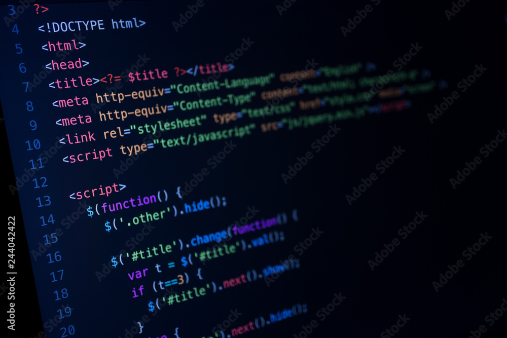

# *__Carrera de autos en Java__*

## Descripción
Este proyecto va sobre la creación en código de una carrera de autos y motos en Java.
***
## Datos y Clases
- Clase Coche con atributos como velocidad, cv, kilómetro y marca.
- Clase Moto con atributos similares.
- Clase Entrada, que crea los objetos y llama a los métodos correspondientes.
***
## Uso
Se puede usar en distintos IDEs.
